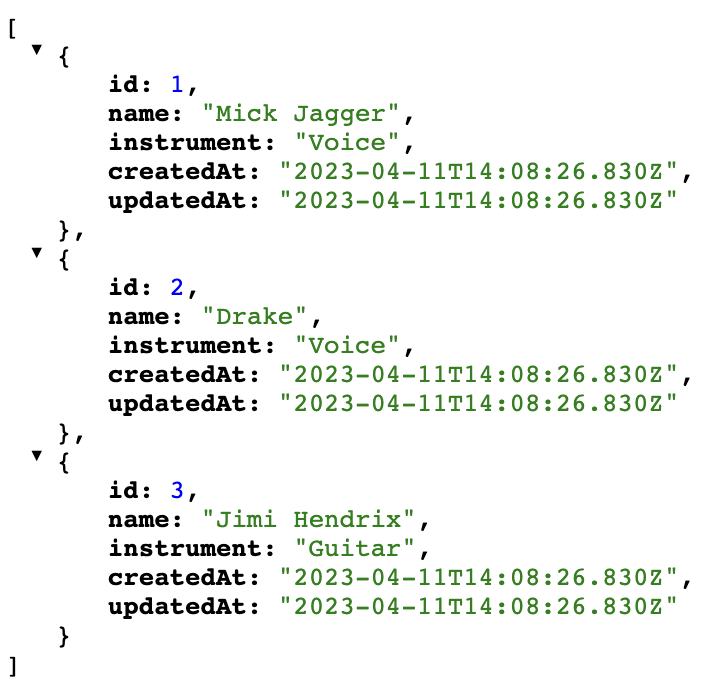
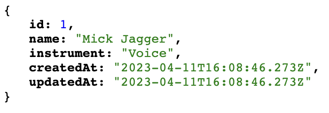
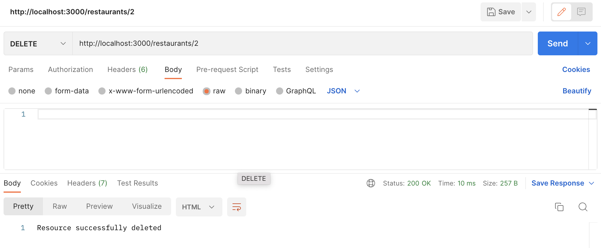
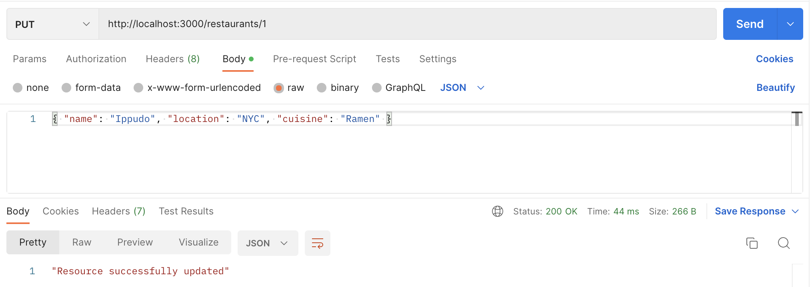

# Express Musicians
Over the next series of lessons we will be building an application using Express that will be able to `GET`, `POST`, `PUT`, and `DELETE` musicians from Musicians DB

## Setup
After forking and cloning the repository, run the following (`npm run seed` runs the seed file):

```bash
npm install
npm run seed
npm start
```

## Part 1: `GET` Musicians
1. Create a `GET /musicians` route for app with `req` and `res` parameters.
2. Get all musicians via the `Musician.findAll()` method within the route.
    - Remember to use `async` and `await`
    - Note that you only need to run `npm run seed` once in order to put data into the musician database.
3. Send the musicians as a JSON Response (`response.json()`).
4. Start your server with node server.js.
5. Test your endpoint by visiting http://localhost:3000/musicians. Your browser should output the following:



6. In `index.test.js`, create tests to verify that your `GET /musicians` endpoint is returning the desired information. A few useful tips to aid your unit test creation:
    - The response to an endpoint can be accessed using the `supertest` package. You will need to require this in your testing file.
    ```javascript
    const request = require("supertest");
    ```
    - You can send a request using the `.get()` method
    ```javascript
    test("Testing bakedGoods endpoint", async () => {
        // Sends request to `/bakedGoods` endpoint
        const response = await request(app).get("/bakedGoods");
    })
    ```
    - A HTTP status code of 200 indicates a successful GET request was made. We can access a status code using the `response.statusCode` method.
    ```javascript
    test("Testing bakedGoods endpoint", async () => {
        // Sends request to `/bakedGoods` endpoint
        const response = await request(app).get("/bakedGoods");
        expect(response.statusCode).toBe(200);
    })
    ```
    - When sending data from a database the response sends a JSON string. To convert this back to a JSON object where we can access values, we can use `JSON.parse()` on the text in the response.
    ```javascript
    test("Testing bakedGoods endpoint", async () => {
        // Sends request to `/bakedGoods` endpoint
        const response = await request(app).get("/bakedGoods");
        const responseData = JSON.parse(response.text);
        // Write expect tests here
    })
    ```

## Part 2: Route Parameters
In `src/app.js`:
1. Use Express to create `GET /musicians/:id` endpoint.
2. In `GET /musicians/:id` get the id using the `req.params` object.
3. In `GET /musicians/:id` get the particular musician via the method `findByPk()`.
4. Send the found musician as a JSON response (`res.json()`).
5. Start your server with `node server.js`
6. Test your endpoint using Postman or your browser by sending a GET request to http://localhost:3000/musicians/1. Your browser should output the following on Postman:



7. In `index.test.js`, create tests for this new endpoint.

## Part 3: `POST`, `PUT`, and `DELETE` Musicians
In `src/app.js`:
1. Call `app.use()` and pass it `express.json()` so that we can parse the request body that contain JSON objects.
2. Call `app.use()` and pass it `express.urlencoded()` so that we can parse the request body with urlencoded values.
2. Create an Express route for creating (adding) a new musician on your musician database.
3. Create an express route for updating (replacing) an existing musician with a new musician in your musician database based on ID in the route. 
    - For example, `PUT musicians/2` would update the musician with an ID of 2.
4. Create an express route for deleting (removing) a musician in your database based on the id in the route.
    - For example, `POST musicians/2` would delete the musician with an ID of 2.
5. Test  your endpoints on Postman by making a `GET`, `POST`, `PUT`, and `DELETE` requests to http://localhost:3000/musicians/
6. In `index.test.js`, create tests for this new endpoint.

### Sending HTTP Requests with Postman

**`DELETE`**

`DELETE` requests typically do not have a request body. To send these requests in Postman:

1. Start the server using node server.js. 
2. Copy the URL (something like https://localhost:3000/musician/1) into Postman. 
3. Set the method to `DELETE`
4. Send the request. 
5. When you refresh the URL, you will see the value has been deleted.



**`PUT` and `POST`**

Creating and updating values with `POST` and `PUT` requests requires that we send information in the body of the HTTP request. To send these requests in Postman:

1. Set the method to `PUT` or `POST`
2. In Postman, select Body and then "raw". 
3. Paste the object into the body and ensure it is formatted correctly (i.e. JSON key values need to be in quotes).
4. Send the request
5. Refresh the page to see the updated array of values.



6. In `index.test.js`, update the tests to reflect the functionality you created above.

## Part 4: Express Router
1. Create a new directory called `routes` for your Express router(s)
2. Include a file (like `musicians.js`) within the `routes` directory to represent your Express router
3. Define your Express router to be able to handle creating, reading, updating, and deleting resources from your `Musician` database.
4. Export your musicians router
5. Include a reference to your router in your main express server in `server.js`
6. Use the Express router in your main server
7. Remove any pre-defined routes from your main server and use only your Express router.
8. Test your endpoints using Postman
9. In `index.test.js`, create unit tests to test the functionality that you created above.

## Part 5: Server Side Validation
1. Run `npm install express-validator` to install the Express Validator package
2. Include the `check` and `validationResult` methods from the Express Validator package in your Express Router for musicians.
3. Navigate to your `POST` Request route to `/musicians` from your Express router and include a parameter `[]` in between the endpoint and the callback function.
4. Within the array `[]` include a first item which checks that the `“name”` field in the `request.body` is not empty and doesn’t only contain whitespace.
5. Within the array `[]` include a second item that checks that the `“instrument”` in the `request.body` is not empty and doesn’t only contain whitespace.
6. Within the callback function, validate the results of your checks and store them in a variable named `errors`.
7. Check that if the `errors` reference is not empty (there are errors), respond with a JSON that contains the key `error` and the value `errors.array()`.
8. If the `errors` reference is empty (there are no errors), then continue with adding the musician to the `Musicians` DB and return a list of all the musicians including the newly added one.
9. Test your endpoint using Postman. 
    - Check to see if you can add a musician without a value in the `“name”` field.
    - Check to see if you can add a musician without a value in the `“instrument”` field.
10. In `index.test.js`, create unit tests that test that an errors array is returned when the `"name"` and/or `"instrument"` fields are empty.

## Extension Problems 🚀

### `Band` Association
In addition to a `Musician` model, there is a `Band` model that is associated by the following relationship:
- Every Musician has one `Band`, but a `Band` can have many `Musician` instances.

1. In models/index.js, define the following association:
    - Every `Musician` has one Band, but a `Band` can have many `Musician` instances.
2. In your routes directory, define a `bands.js` route.
3. Create a `GET /bands` endpoint that returns all the `Band` instances including the `Musician` instances that are part of that `Band`.
4. Create a `GET /bands/:id` endpoint that returns the `Band` based on the ID passed into the request, and include the `Musician`(s) that are part of that particular `Band`. 
5. Export your bands router.
6. Include a reference to your router in your main express server in `app.js`.
7. Use the Express router in your main server
8. Test your route with Postman
9. In `index.test.js`, create unit tests to test the functionality that you created above.

### Additional Challenges
1. Include the third item within your array [] that checks that the `"name"` field has a length between 2 and 20. (Minimum 2, Maximum 20). [Use this reference](https://github.com/validatorjs/validator.js#validators) to locate the best method for checking the length of the value passed into the musician’s `"name"` field.
2. Include the fourth item within your array `[]` that checks that the `"instrument"` field has a length between 2 and 20. (Minimum 2, Maximum 20).
3. Update the `PUT /musicians/:id` route with server side validation like you did for the `POST` route.
4. In `index.test.js`, create tests that test the new functionality you created.